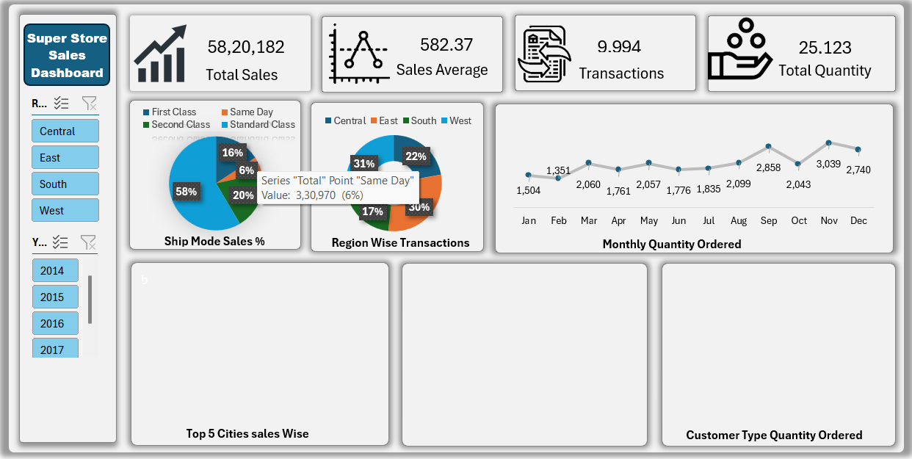

# 📊 Super Store Sales Dashboard | Microsoft Excel

An interactive Sales Dashboard built in Microsoft Excel to analyze retail sales performance across different regions, customer segments, shipping modes, and product categories. The dashboard provides dynamic insights using Pivot Tables, Pivot Charts, KPI Cards, and Slicers for interactive data exploration.

---

## 📷 Dashboard Preview

> **Current Dashboard**



---

## 📌 Project Overview

This dashboard helps analyze sales performance through interactive visualizations and filters. Users can filter the dashboard by **Region** and **Year**, allowing all KPIs and charts to update dynamically.

### Dashboard Highlights

- 📈 Total Sales KPI
- 📊 Average Sales KPI
- 🧾 Total Transactions KPI
- 📦 Total Quantity Sold KPI
- 🚚 Ship Mode Sales Distribution
- 🌍 Region-wise Transactions
- 📅 Monthly Quantity Ordered Trend
- 🏙️ Top 5 Cities by Sales
- 📂 Category-wise Transactions
- 👥 Customer Type Quantity Ordered
- 🎛️ Interactive Region & Year Slicers

---

## 🛠 Tools Used

- Microsoft Excel
- Pivot Tables
- Pivot Charts
- Slicers
- Conditional Formatting
- Excel Formulas
- Data Visualization

---

## 📈 Key Performance Indicators

| KPI | Value |
|------|-------|
| Total Sales | 5,820,182 |
| Average Sales | 582.37 |
| Total Transactions | 9,994 |
| Total Quantity Sold | 25,123 |

---

## 📊 Dashboard Insights

### Overall Business Performance
- Generated **5.82 Million** in total sales.
- Processed **9,994** customer transactions.
- Sold **25,123** products.
- Average sales value per transaction is **582.37**.

### Shipping Analysis
- Standard Class contributes the highest share (**58%**).
- Second Class accounts for **20%**.
- First Class contributes **16%**.
- Same Day shipping represents **6%**.

### Regional Analysis
- West Region contributes the highest transaction share (**31%**).
- East Region follows with **30%**.
- Central Region contributes **22%**.
- South Region contributes **17%**.

### Monthly Sales Trend
- Order quantities remain stable during the first half of the year.
- Sales increase significantly from August onward.
- September and November are the strongest months.

### Customer Analysis
- Consumer customers order the highest quantity.
- Corporate customers are the second-largest segment.
- Home Office customers contribute the least quantity.

---

## 📂 Project Structure

```
SuperStore-Sales-Dashboard/
│
├── Dashboard.xlsx
├── Dashboard.png
├── README.md
└── Dataset.xlsx
```

---

## 🚀 Future Improvements

- Profit Dashboard
- Sales Forecasting
- Power BI Version
- SQL Integration
- Power Query Automation
- Dynamic Date Filters

---

## 👨‍💻 Author

**Your Name**Dushyant

GitHub: https://github.com/yourusername

LinkedIn: https://linkedin.com/in/your-profile
